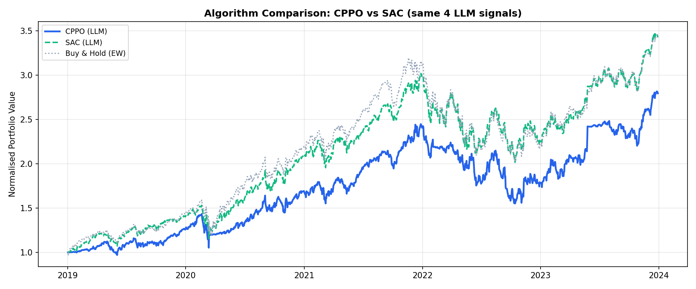
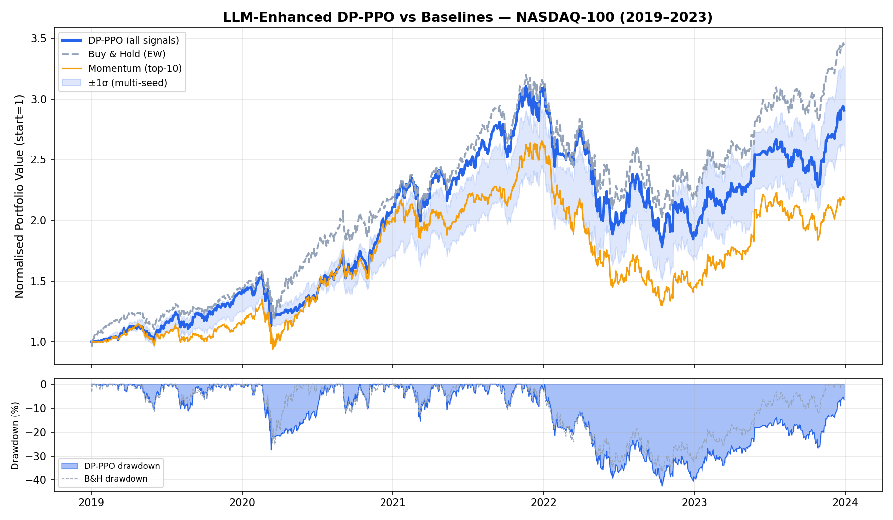
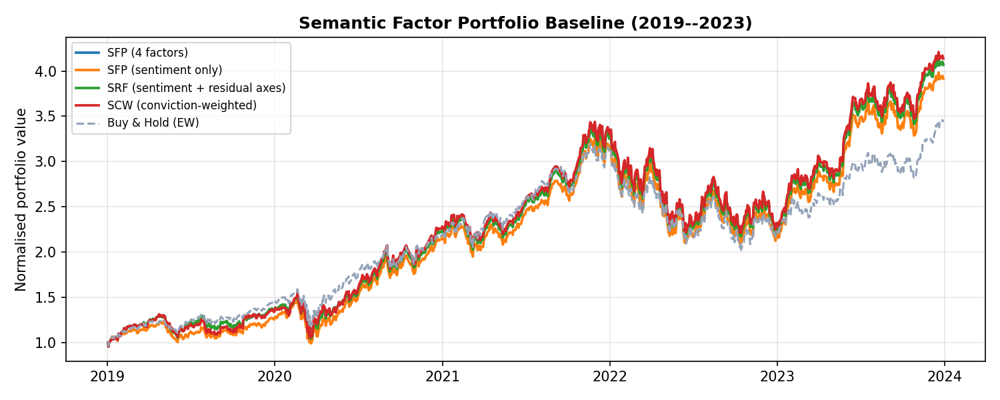
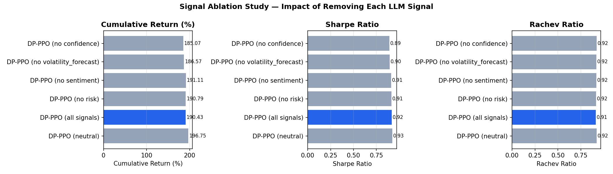
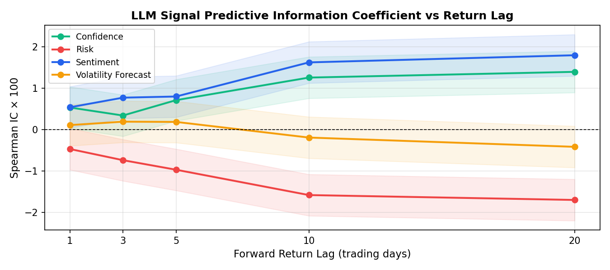

# Semantic State Abstraction Interfaces (SSAI)
### Controlled Evaluation of LLM-Derived Signals in RL-Based Trading

[](https://hal.science/view/index/docid/5613426)
[](paper/main.pdf)
[](https://discord.gg/ekrySuRBf4)

> **SSAI** maps sparse financial news into K=4 named scalar axes (sentiment, risk, confidence, volatility forecast) via zero-shot LLM prompts and evaluates them across three estimator families — factor portfolios, ridge forecasters, and RL agents — sharing the same frozen interface. The framework is diagnostic: it precisely characterises where LLM signals add value and where they do not.

---

## Results

### RL: SAC vs DP-PPO (same 4 LLM signals)
SAC achieves significantly higher Sharpe than DP-PPO under identical observations (Mann-Whitney **p = 0.027**), confirming the gap is algorithm-driven, not representation-driven.



---

### Equity curves: DP-PPO vs baselines (2019–2023, NASDAQ-100)



---

### Semantic Factor Portfolio (SFP) — all four axes vs Buy & Hold



---

### Signal ablation — impact of removing each LLM axis



---

### LLM signal predictive IC across return horizons



---

## Key findings

| Finding | Result |
|---------|--------|
| SAC Sharpe vs DP-PPO | **1.059 ± 0.140** vs 0.920 ± 0.099, p = 0.027 |
| PC1-SFP vs Softmax-SFP | 433.6% vs **439.8%** CR — equal-weight axes ≈ PC1 |
| FinBERT-SFP | 386.3% CR (direct ranking) vs 125% (ridge feature) |
| SFP vs Buy & Hold | 307.2% vs 243.6% — driven by basket selection, not signal direction |
| DP-PPO full vs neutral (21 seeds) | Sharpe 0.920 vs 0.907, p ≈ 0.25–0.31 (underpowered) |

---

## Resources

| Resource | Link |
|----------|------|
| **Paper (HAL preprint)** | [hal.science/5613426](https://hal.science/view/index/docid/5613426) |
| **Paper PDF** | [`paper/main.pdf`](paper/main.pdf) |
| **Public version (HAL)** | [`paper/main_hal.pdf`](paper/main_hal.pdf) |
| **LaTeX sources + figures** | [`hal_sources.zip`](hal_sources.zip) |
| Hugging Face — data | [NASDAQ 2013–2023](https://huggingface.co/datasets/benstaf/nasdaq_2013_2023/tree/main) |
| Hugging Face — agents | [Trading_agents](https://huggingface.co/benstaf/Trading_agents/tree/main) |
| arXiv (prior version) | [2502.07393](https://arxiv.org/abs/2502.07393) |

---

## Quick start

```bash
python -m venv .venv && source .venv/bin/activate
pip install -r requirements.txt
pip install -e spinningup_src/
```

Download data from Hugging Face (links above), then reproduce the main tables:

```bash
python eval_harness.py          # paper/tables + paper/figures
python multi_seed_eval.py --mode eval --seeds 5
python signal_ic_report.py
python pc1_sfp_baseline.py      # PC1 factor portfolio
python softmax_sfp_baseline.py  # equal-weight auditable baseline
python finbert_sfp_baseline.py  # FinBERT factor portfolio
python train_sac_baseline.py --episodes 300 --seed 0
```

For the interactive dashboard: `./dashboard/start.sh` (FastAPI + Vite).

---

## Citation

```bibtex
@misc{ssai2026,
  title  = {Semantic State Abstraction Interfaces for LLM-Augmented Portfolio Decisions},
  author = {Yerra, Likhita},
  year   = {2026},
  url    = {https://hal.science/view/index/docid/5613426}
}
```

See [`CITATION.cff`](CITATION.cff) for GitHub/Zenodo metadata.
